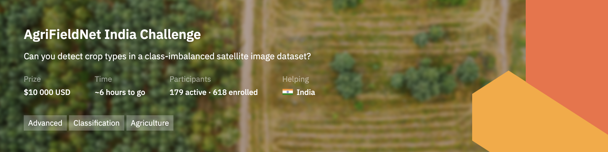

# [AgrifieldNet India Competition](https://zindi.africa/competitions/agrifieldnet-india-challenge). 


The dataset for this challenge consists crop types of agricultural fields in four states of Uttar Pradesh, Rajasthan, Odisha and Bihar in northern India. There are 13 different classes in the dataset including Fallow land and 12 crop types of Wheat, Mustard, Lentil, Green pea, Sugarcane, Garlic, Maize, Gram, Coriander, Potato, Bersem, and Rice.

### Evaluation
* The evaluation metric for this challenge is Cross Entropy with binary outcome for each crop

### Environment

```bash
git clone https://github.com/adeshkin/agrifieldnet_india_competition.git
cd agrifieldnet_india_competition
python3 -m venv ./venv
source venv/bin/activate
pip install -r requirements.txt
```

## Solution

* Averaging the pixels of each field_id
* Adding remote sensing indices - [source1](https://journals-crea.4science.it/index.php/asr/article/view/1463), [source2](https://sentinel-hub.com/develop/documentation/eo_products/Sentinel2EOproducts)
* GridSearchCV - exhaustive search over specified parameter values for an estimator
* Ensemble 6 model - mean of predictions

### Hypotheses
* important feature selection 
* neural network? 
* way of average of predictions

